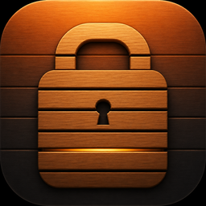

# Amado 

[](https://github.com/PangMo5/Amado/releases/latest)
[](https://github.com/PangMo5/Amado/releases)


[](LICENSE)

Lock your Mac from iPhone, Apple Watch, a widget, or Control Center.

*Amado* (雨戸) are the sliding shutters that close a Japanese house. One tap
closes your Mac the same way: the menu-bar agent immediately returns it to the
login window.

## Features

- **Everywhere you need it** — lock from the iPhone app, Apple Watch, a Home
  Screen widget, or Control Center.
- **Fast on your LAN** — Bonjour discovery and a direct authenticated command,
  with no account or hosted service.
- **Remote when you choose** — bring your own HTTPS tunnel; Amado never proxies
  commands through a service operated by this project.
- **Walk-away auto-lock** — the Mac can use your nearby iPhone's Bluetooth
  signal as a proximity trigger.
- **Authenticated pairing** — QR pairing provisions a 256-bit secret used for
  HMAC-SHA256 authentication, timestamp checks, and replay protection.

## How it works

```text
Apple Watch ── WatchConnectivity ──▶ iPhone ─┬─ Bonjour + TCP ───────▶ Mac
Widget / Control Center / iPhone app ────────┤
                                             └─ HTTPS tunnel ───────▶ Mac
```

The iPhone client tries the local network first and uses the paired Mac's
optional tunnel only when LAN delivery is unavailable. The tunnel forwards to a
loopback-only HTTP listener on `127.0.0.1:51521`.

See [Security](docs/SECURITY.md) for the trust model and protocol boundaries.

## Install

Install the macOS agent with Homebrew:

```sh
brew install --cask PangMo5/tap/amado
```

Or download it from [GitHub Releases](https://github.com/PangMo5/Amado/releases).
Sparkle checks for updates in the background, and **Check for Updates…** is
available from the menu-bar item. The iPhone, widget, and Watch clients
currently build from source.

1. Launch Amado on the Mac and enable **Launch at Login** if wanted.
2. Open **Settings › Pairing › Reveal pairing code**.
3. In the iPhone app, scan the QR code.
4. Use the app, widget, Control Center control, or Watch app to lock the Mac.

## Configuration

Most settings are available in the Mac app. Non-sensitive values also live at
`~/.config/amado/config.toml` (or `$XDG_CONFIG_HOME/amado/config.toml`) and are
reloaded when the file changes. Pairing secrets stay in Keychain.

| Setting | Default | Purpose |
| --- | ---: | --- |
| `remote_host` | `""` | Public hostname of your HTTPS tunnel; empty is LAN-only |
| `proximity_auto_lock` | `false` | Lock when the selected iPhone leaves |
| `proximity_far_rssi` | `-56` | Far threshold in dBm |
| `proximity_grace_seconds` | `2` | Time beyond the threshold before locking |
| `proximity_smoothing` | `3` | Number of RSSI samples to average |

See the complete [`config.toml` reference](docs/CONFIGURATION.md),
[pairing guide](docs/PAIRING.md), [remote access guide](docs/REMOTE_ACCESS.md),
and [proximity auto-lock guide](docs/PROXIMITY_AUTO_LOCK.md).

## Build from source

```sh
export TUIST_DEVELOPMENT_TEAM=YOUR_TEAM_ID
mise install
make bootstrap
open Amado.xcworkspace
```

## Tech stack

- Tuist-generated Xcode workspace
- The Composable Architecture and Sharing
- Hummingbird for the loopback HTTP endpoint
- Sparkle for macOS updates
- WidgetKit, App Intents, and WatchConnectivity
- Swift Testing and strict Swift 6 concurrency

## License

[Mozilla Public License 2.0](LICENSE). MPL-2.0 is file-level copyleft: changes
to MPL-covered files remain under MPL-2.0, while new files may use another
compatible license. Executable distribution is allowed as long as recipients
can access the covered source.
