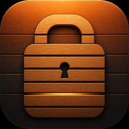

# Amado 

[](https://github.com/PangMo5/Amado/releases/latest)
[](https://github.com/PangMo5/Amado/releases)


[](LICENSE)

One tap. Walk away. Close the lid.

*Amado* (雨戸) are the sliding shutters that close a Japanese house. One tap
closes your Mac the same way. Amado can also lock automatically when you leave,
or keep a MacBook working with its lid closed when you explicitly enable
Caffeinate.

## Features

- **One tap, everywhere:** Lock from the iPhone app, Apple Watch, a Home
  Screen widget, or Control Center.
- **Automatic when you leave:** Bluetooth proximity lets the Mac lock itself
  when you walk away with your iPhone. Smart detection is the default; Manual
  mode keeps direct RSSI, delay, and smoothing controls.
- **Caffeinate when you close the lid:** Keep a MacBook running closed with a
  user-approved Power Helper. Choose whether the login session locks, or keep
  it explicitly unlocked when physical and remote access are already controlled.
  Awake policies become available only after the current helper is installed.
- **Verified feedback:** Each one-tap control tells you whether the Mac was
  already locked, became locked, or accepted the request without confirming
  the state transition. Control Center uses native momentary status text, while
  the Home Screen widget updates its own icon and message and can refresh the
  Mac's current status on demand.
- **Conservative Smart detection:** The rolling nearby reference cannot be
  tightened by a momentarily stronger reading, so ordinary desk-range fading
  is less likely to look like departure.
- **Pause when you need it:** Suspend proximity auto-lock for 15 minutes to
  four hours, or choose an exact resume time. The pause survives a relaunch and
  ends automatically without turning auto-lock off.
- **Visible, self-healing agent:** Service, Bluetooth, login, persistence, and
  screen-lock failures surface in the menu bar, Settings, and notifications.
  Recoverable listeners retry instead of failing silently.
- **Fast on your LAN:** Bonjour discovery and a direct authenticated command,
  with no account or hosted service.
- **Remote when you choose:** Bring your own HTTPS tunnel. Amado never proxies
  commands through a service operated by this project.
- **Authenticated pairing:** QR pairing provisions a 256-bit secret used for
  HMAC-SHA256 authentication, timestamp checks, and replay protection.
- **Stable device identity:** Macs use the name supplied by macOS, while each
  iPhone installation gets a short stable label derived from its UUID.

> [!WARNING]
> Caffeinate deliberately prevents normal lid-close sleep. A closed Mac can
> consume battery and trap heat: keep it on a hard, stable, well-ventilated
> surface and never leave it running in a bag, bedding, or another enclosed
> space. You are responsible for monitoring the Mac and disabling Caffeinate
> if conditions become unsafe. **Stay awake, keep unlocked** also leaves the
> live login session available to anyone with physical access or access through
> remote-control software already enabled on the Mac. To the extent permitted
> by law, Amado and its contributors are not liable for resulting battery
> depletion, data loss, hardware damage, or injury. Follow [Apple's temperature
> and ventilation guidance](https://support.apple.com/102336).

## How it works

```text
Apple Watch ── WatchConnectivity ──▶ iPhone ─┬─ Bonjour + TCP ───────▶ Mac
Widget / Control Center / iPhone app ────────┤
                                             └─ HTTPS tunnel ───────▶ Mac
Nearby iPhone ───────── Bluetooth proximity ────────────────────────▶ Mac
MacBook lid ─────────── Caffeinate + Power Helper ─────────▶ Mac stays awake
```

The iPhone client tries the local network first and uses the paired Mac's
optional tunnel only when LAN delivery is unavailable. The tunnel forwards to a
loopback-only HTTP listener on `127.0.0.1:51521`. Use a control when you want an
immediate lock. The same authenticated connection returns the Mac's observed
lock state, and the iPhone app can refresh that state on demand. Enable
proximity auto-lock when you want walking away to be enough; it runs on the Mac
and does not require the iPhone app to stay open. The Mac also keeps a local
list of paired iPhones. Removing a pairing from either side is synchronized the
next time the devices connect. Stable UUIDs identify each installation
independently of its displayed name.

Caffeinate is local to the Mac. A narrowly scoped, code-signing-pinned Power
Helper holds the system sleep override only while the Amado app keeps its XPC
lease alive. It is not exposed through the pairing or remote-lock protocol.

See [Security](docs/SECURITY.md) for the trust model and protocol boundaries.

## Install

Install the macOS agent with Homebrew:

```sh
brew install --cask PangMo5/tap/amado
```

Or download it from [GitHub Releases](https://github.com/PangMo5/Amado/releases).
Sparkle checks for updates in the background, and **Check for Updates…** is
available from the menu-bar item and **Settings › About**. The companion
iPhone app, widget, and Watch app are distributed together through TestFlight.

1. Launch Amado on the Mac and enable **Launch at Login** if wanted.
2. Open **Settings › Pairing › Reveal pairing code**.
3. In the iPhone app, scan the QR code.
4. Use the app, widget, Control Center control, or Watch app to lock the Mac.
5. Optionally enable **Auto-lock** so leaving with the iPhone locks it for you.
6. Optionally open **Caffeinate**, explicitly install and approve the Power
   Helper, wait for its status to become **Installed**, then choose an awake
   policy.

## Configuration

Most settings are available in the Mac app. Non-sensitive values also live at
`~/.config/amado/config.toml` (or `$XDG_CONFIG_HOME/amado/config.toml`) and are
reloaded when the file changes. Pairing secrets stay in Keychain.

| Setting | Default | Purpose |
| --- | ---: | --- |
| `mac_id` | generated once | Stable Mac identity shared with paired clients |
| `remote_host` | `""` | Public hostname of your HTTPS tunnel. Empty is LAN-only. |
| `caffeinate_mode` | `"off"` | `"off"`, `"lock"`, or `"unlocked"` behavior when the lid closes |
| `proximity_auto_lock` | `false` | Lock when the selected iPhone leaves |
| `caffeinate_pauses_auto_lock` | `false` | Pause Auto-lock while Caffeinate keeps the Mac unlocked |
| `proximity_pause_until` | omitted | Unix timestamp when a temporary pause ends |
| `proximity_mode` | `"smart"` | Adaptive detection, or `"manual"` for direct RSSI controls |
| `proximity_sensitivity` | `"balanced"` | Smart-mode reaction preset |
| `proximity_far_rssi` | `-56` | Manual-mode far threshold in dBm |
| `proximity_grace_seconds` | `2` | Manual-mode threshold confirmation time |
| `proximity_smoothing` | `3` | Manual-mode RSSI averaging window |

See the complete [`config.toml` reference](docs/CONFIGURATION.md),
[pairing guide](docs/PAIRING.md), [remote access guide](docs/REMOTE_ACCESS.md),
[proximity auto-lock guide](docs/PROXIMITY_AUTO_LOCK.md), and
[Caffeinate guide](docs/CAFFEINATE.md).

## Build from source

```sh
export TUIST_DEVELOPMENT_TEAM=YOUR_TEAM_ID
mise install
make bootstrap
open Amado.xcworkspace
```

## Tech stack

- Tuist-generated Xcode workspace
- The Composable Architecture and Sharing
- Hummingbird for the loopback HTTP endpoint
- Sparkle for macOS updates
- WidgetKit, App Intents, and WatchConnectivity
- Swift Testing and strict Swift 6 concurrency

## License

The macOS app, Power Helper, tests, tooling, documentation, and website are
licensed under [GNU Affero General Public License v3.0 only](LICENSE)
(`AGPL-3.0-only`). Copyright (C) 2026 PangMo5.

The iPhone, Apple Watch, Widget, and shared `AmadoKit` sources remain under the
[Mozilla Public License 2.0](LICENSES/MPL-2.0.txt) (`MPL-2.0`). See
[NOTICE.md](NOTICE.md) and `REUSE.toml` for the exact path-level boundary.
Third-party components remain under their respective upstream licenses.
